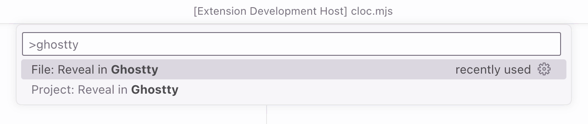

# Reveal in Ghostty 📂

Reveal current project or folder in [Ghostty](https://ghostty.org/).

**[Install from Visual Studio Marketplace](https://marketplace.visualstudio.com/items?itemName=sapegin.reveal-in-ghostty)**

## Commands

You can either run this commands from the Command Palette (<kbd>Cmd</kbd>+<kbd>Shift</kbd>+<kbd>P</kbd> on a Mac, or <kbd>Ctrl</kbd>+<kbd>Shift</kbd>+<kbd>P</kbd> on Windows), or [assign hotkeys](https://code.visualstudio.com/docs/getstarted/keybindings).

| Description                  | Name                            |
| ---------------------------- | ------------------------------- |
| Reveal project root folder   | `revealInGhostty.revealProject` |
| Reveal currently open folder | `revealInGhostty.revealFile`    |

## Changelog

The changelog can be found on the [Changelog.md](./Changelog.md) file.

## You may also like

Check out my other Visual Studio Code extensions:

- [Emoji Console Log](https://marketplace.visualstudio.com/items?itemName=sapegin.emoji-console-log): insert `console.log()` statements with a random emoji
- [Mini Markdown](https://marketplace.visualstudio.com/items?itemName=sapegin.mini-markdown): minimalist kit for comfortable Markdown writing
- [New File Now](https://marketplace.visualstudio.com/items?itemName=sapegin.new-file-now): create new files from the command palette
- [Notebox](https://marketplace.visualstudio.com/items?itemName=sapegin.notebox): take quick notes in the bottom panel
- [Todo Tomorrow](https://marketplace.visualstudio.com/items?itemName=sapegin.todo-tomorrow): highlight `TODO`, `HACK`, `FIXME`, etc. comments
- [Reveal in Nimble Commander](https://marketplace.visualstudio.com/items?itemName=sapegin.reveal-in-nimble-commander): reveal current project or folder in Nimble Commander
- [Squirrelsong Light Theme](https://marketplace.visualstudio.com/items?itemName=sapegin.Theme-SquirrelsongLight): low contrast non-distracting light theme for web developers
- [Squirrelsong Dark Theme](https://marketplace.visualstudio.com/items?itemName=sapegin.Theme-SquirrelsongDark): low contrast non-distracting dark theme for web developers

Additionally, check out [my theme for Ghostty](https://sapegin.me/squirrelsong/ghostty/).

## Sponsoring

This software has been developed with lots of coffee, buy me one more cup to keep it going.

## Contributing

Bug fixes are welcome, but not new features. Please take a moment to review the [contributing guidelines](Contributing.md).

## Authors and license

[Artem Sapegin](https://sapegin.me), and [contributors](https://github.com/sapegin/vscode-reveal-in-ghostty/graphs/contributors).

MIT License, see the included [License.md](License.md) file.
